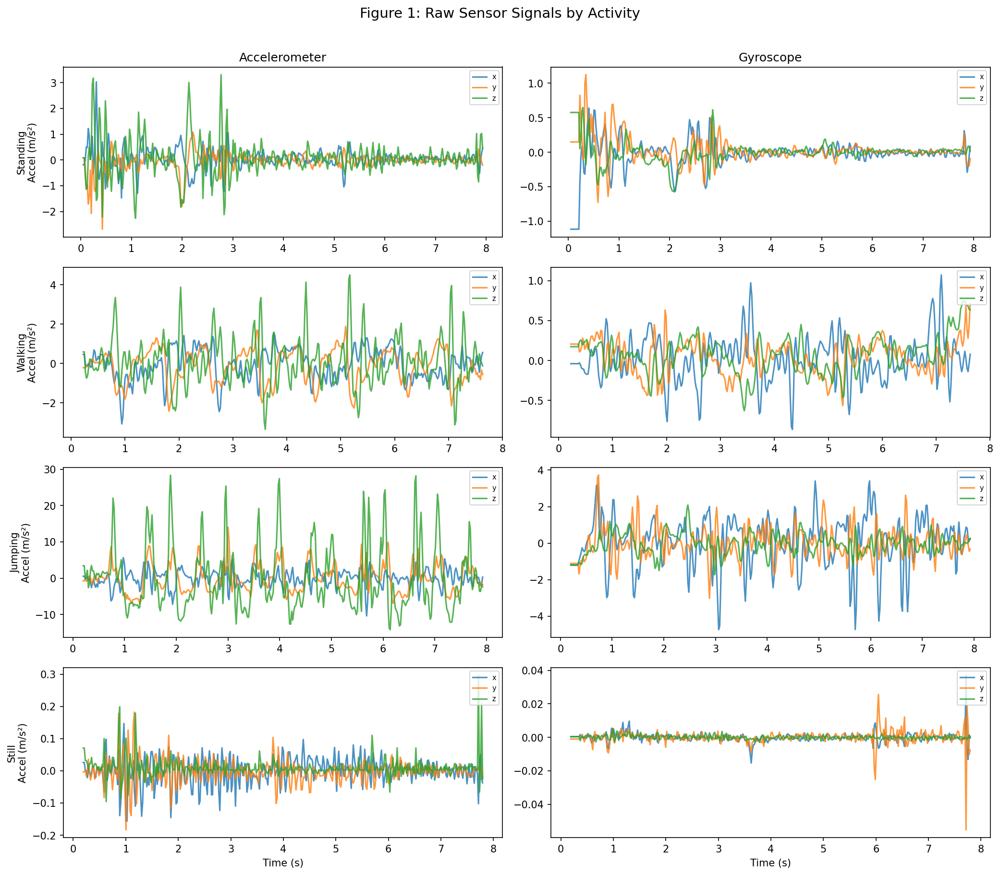
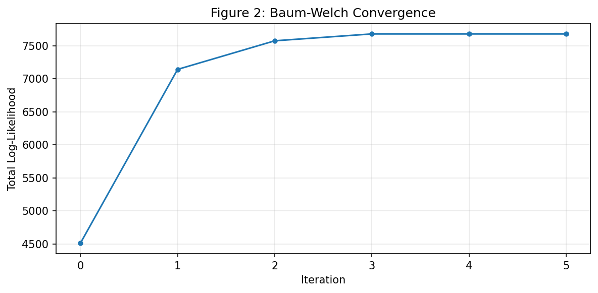
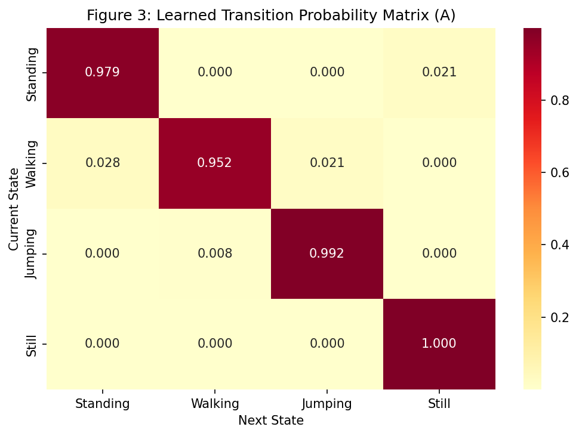
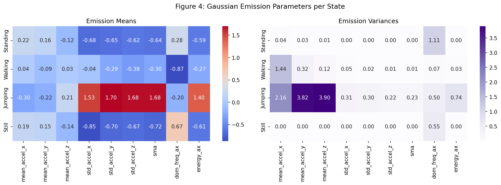
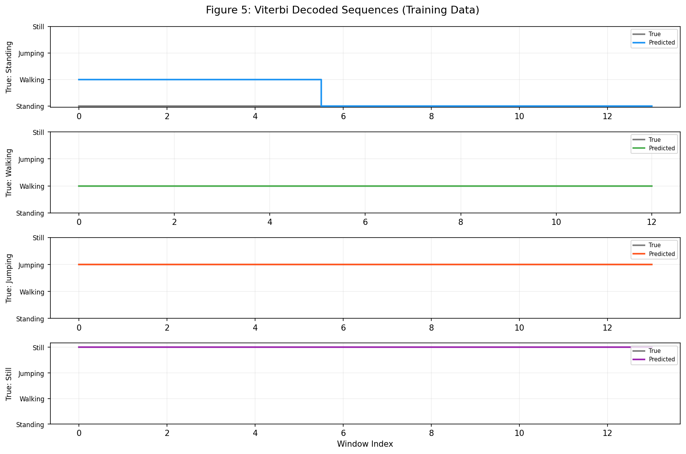
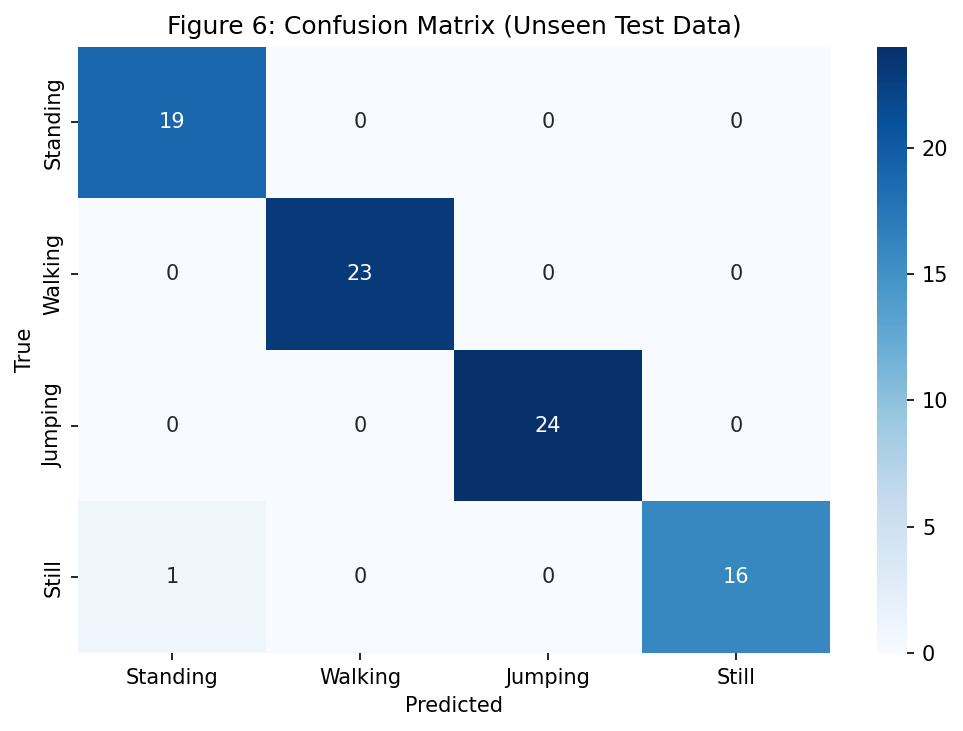
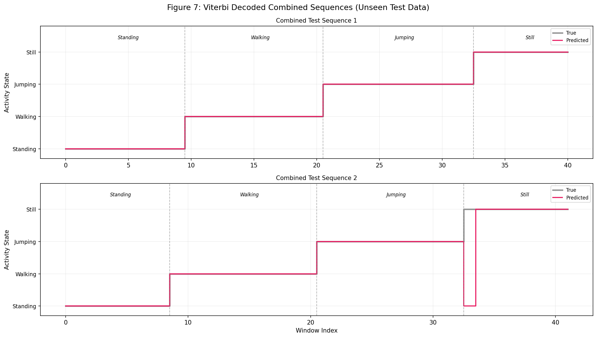

# Modeling Human Activity States Using Hidden Markov Models

> Recognizing human activities (Standing, Walking, Jumping, Still) from smartphone accelerometer and gyroscope data using a Gaussian Hidden Markov Model built from scratch in Python.

---

## Overview

Human Activity Recognition (HAR) is a critical component in modern applications such as wearable health monitors, elderly fall detection systems, fitness trackers, and smart home automation. Continuous data streams from inertial sensors (accelerometers and gyroscopes) embedded in smartphones provide valuable information about a person's physical state. However, the true activity is hidden behind noisy sensor measurements, making it a natural candidate for probabilistic sequence modeling.

In this project, we implement a **Gaussian Hidden Markov Model (HMM) from scratch** using NumPy to infer four human activities from smartphone sensor data collected using the [Sensor Logger](https://www.tszheichoi.com/sensorlogger) app. Our unique use case focuses on recognizing activities from **two different Android devices** with the same sampling rate, demonstrating **cross-device generalization** for practical HAR deployment.

**Key Results:** The model achieves **98.80% overall accuracy** on unseen combined multi-activity test sequences.

---

## Project Structure

```
Hidden Markov Models/
|
|-- data/                                  # Cleaned, labelled sensor data
|   |-- Standing/                          # 15 CSV files
|   |   |-- standing_phone1_01.csv
|   |   |-- standing_phone2_01.csv
|   |   |-- ...
|   |-- Walking/                           # 14 CSV files
|   |-- Jumping/                           # 14 CSV files
|   |-- Still/                             # 14 CSV files
|
|-- figures/                               # Generated visualization plots
|   |-- fig1_raw_signals.png
|   |-- fig2_convergence.png
|   |-- fig3_transition_matrix.png
|   |-- fig4_emission_params.png
|   |-- fig5_training_decoded.png
|   |-- fig6_confusion_matrix.png
|   |-- fig7_test_decoded.png
|
|-- hmm_activity_recognition_v2.ipynb      # Main notebook (HMM implementation)
|-- generate_report.py                     # Script to generate .docx report
|-- HMM_Activity_Recognition_Report.docx   # Final project report
|-- rubric.txt                             # Project rubric/requirements
|-- README.md                              # This file
```

---

## 1. Data Collection

Data was collected by two group members using different Android smartphones and the **Sensor Logger** app. Each member recorded 5-10 second clips of four activities.

### Devices and Sampling Rates

| Phone | Device | Sampling Rate | Files Collected |
|:---:|:---:|:---:|:---:|
| Phone 1 | STK-L22 | 20ms (50 Hz) | 28 |
| Phone 2 | Infinix X6855 | 20ms (50 Hz) | 29 |

Both phones use the same 20ms (50 Hz) sampling interval, so **no resampling or harmonization** was needed.

### Activities Recorded

| Activity | Files | Phone 1 | Phone 2 | Total Duration |
|:---:|:---:|:---:|:---:|:---:|
| Standing | 15 | 7 | 8 | 132.2s (2.2 min) |
| Walking | 14 | 7 | 7 | 117.6s (2.0 min) |
| Jumping | 14 | 7 | 7 | 121.8s (2.0 min) |
| Still | 14 | 7 | 7 | 112.8s (1.9 min) |
| **Total** | **57** | **28** | **29** | **484.4s (8.1 min)** |

All activities exceed the minimum **1 minute 30 seconds** requirement. A total of **57 well-labelled CSV files** were collected.

### Sensors Recorded

- **Accelerometer** (x, y, z) - measures linear acceleration in m/s²
- **Gyroscope** (x, y, z) - measures angular velocity in rad/s

Each CSV file contains 7 columns: `seconds_elapsed, accel_x, accel_y, accel_z, gyro_x, gyro_y, gyro_z`

### Raw Sensor Signals

<p align="center">
  
</p>
<p align="center"><em>Figure 1: Raw accelerometer (left) and gyroscope (right) signals for one sample recording of each activity. Standing and Still show flat signals, while Walking exhibits rhythmic oscillations and Jumping produces large spikes.</em></p>

---

## 2. Preprocessing and Windowing

### Preprocessing

Each recording from Sensor Logger was saved as a zip file containing separate CSV files for the accelerometer and gyroscope. During preprocessing:

1. Zip files were extracted
2. Accelerometer and gyroscope data were **merged by nearest timestamp** into a single CSV per recording
3. Files were labelled using the convention `activity_phoneN_NN.csv` (e.g., `walking_phone1_03.csv`)

### Windowing

The continuous sensor signals were segmented into fixed-size windows:

| Parameter | Value | Justification |
|:---:|:---:|:---|
| Window Size | 50 samples (1 second) | Captures a full gait cycle for walking (~0.5-1.0s) and at least one full jump cycle. Provides 1 Hz FFT resolution for frequency-domain features. |
| Step Size | 25 samples (50% overlap) | Increases training samples without losing temporal continuity |
| Total Windows | 663 | Across all 57 files |

**Why 1 second at 50 Hz?** At a 50 Hz sampling rate, a 1-second window contains 50 samples, which is sufficient to capture the periodic patterns in human activities (walking at ~2 Hz, jumping at ~1-2 Hz) while providing adequate frequency resolution for FFT-based features.

---

## 3. Feature Extraction

From each 1-second window, we extracted **28 features** comprising both time-domain and frequency-domain characteristics:

### Time-Domain Features (22 features)

| Feature | Count | Description | Justification |
|:---|:---:|:---|:---|
| Mean (per axis) | 6 | Average signal value per sensor axis | Baseline signal level; Standing has distinct z-accel from gravity |
| Standard Deviation (per axis) | 6 | Signal variability per axis | Movement intensity; Jumping has high std, Still near-zero |
| RMS (per axis) | 6 | Root Mean Square per axis | Overall signal energy; higher for dynamic activities |
| Signal Magnitude Area (SMA) | 1 | Sum of absolute values across accel axes | Total body acceleration; separates dynamic vs static |
| Inter-axis Correlation | 3 | Pearson correlation between accel axis pairs | Walking shows correlated axes from rhythmic motion |

### Frequency-Domain Features (6 features)

| Feature | Count | Description | Justification |
|:---|:---:|:---|:---|
| Dominant Frequency (per accel axis) | 3 | Frequency with highest FFT magnitude | Walking peaks at ~2 Hz; Still has no dominant peak |
| Spectral Energy (per accel axis) | 3 | Sum of squared FFT magnitudes | Separates high-energy Jumping from low-energy Still |

### Normalization

All 28 features were normalized using **Z-score standardization** (zero mean, unit variance) to ensure equal contribution regardless of units or scale. Z-score was chosen because:
- Features have different units (m/s², rad/s, Hz, dimensionless)
- Gaussian emission distributions in the HMM assume comparable feature scales
- It preserves the shape of the feature distributions

---

## 4. HMM Model Architecture

We implemented a **Gaussian Hidden Markov Model** from scratch using NumPy with diagonal covariance matrices.

### Model Components

| Component | Symbol | Description |
|:---|:---:|:---|
| Hidden States | Z | 4 activities: Standing, Walking, Jumping, Still |
| Observations | X | 28-dimensional feature vectors from windowed sensor data |
| Transition Matrix | A (4x4) | Probability of transitioning between activities |
| Emission Parameters | B = {mu_k, sigma_k} | Gaussian mean and diagonal covariance per state |
| Initial Probabilities | pi (4x1) | Probability of starting in each activity |

### Key Implementation Details

- **Log-space computation** throughout Forward, Backward, and Viterbi algorithms to prevent numerical underflow
- **Diagonal covariance** for computational stability and to avoid singularity issues with limited training data
- **Label-based initialization** of emission parameters for faster convergence
- **Modular class design** (`GaussianHMM`) with separate methods for each algorithm component

---

## 5. Training with Baum-Welch

The model was trained using the **Baum-Welch (Expectation-Maximization) algorithm** on 49 training sequences (one per training file).

### Algorithm Steps

1. **E-Step:** Compute posterior state probabilities (gamma) and transition posteriors (xi) using Forward-Backward algorithm in log space
2. **M-Step:** Update all parameters (pi, A, means, covariances) to maximize data likelihood
3. **Convergence Check:** Stop when |delta log-likelihood| < epsilon = 1e-4

### Convergence

<p align="center">
  
</p>
<p align="center"><em>Figure 2: Baum-Welch convergence plot. The log-likelihood monotonically increases and plateaus after 6 iterations, confirming correct EM implementation.</em></p>

The algorithm converged in **6 iterations**, with the total log-likelihood increasing from **4,509 to 7,682**.

---

## 6. Results and Evaluation

### 6.1 Learned Transition Probabilities

<p align="center">
  
</p>
<p align="center"><em>Figure 3: Learned transition probability matrix. High diagonal values (close to 1.0) reflect realistic activity persistence - a person walking is very likely to still be walking in the next 1-second window.</em></p>

### 6.2 Emission Distributions

<p align="center">
  
</p>
<p align="center"><em>Figure 4: Gaussian emission parameters per state. Left: mean feature values. Right: feature variances. Clear separation is visible between dynamic (Jumping, Walking) and static (Standing, Still) activities.</em></p>

### 6.3 Viterbi Decoding on Training Data

<p align="center">
  
</p>
<p align="center"><em>Figure 5: Viterbi decoded sequences on training data. Predicted (colored) lines perfectly overlap true (black) lines for all four activities, confirming the trained parameters are consistent with the training data.</em></p>

### 6.4 Evaluation on Unseen Data

The model was evaluated on **2 combined multi-activity test sequences** constructed from **8 held-out files** (2 per activity). Raw sensor data from one file per activity was concatenated in order (Standing -> Walking -> Jumping -> Still), then windowed. This creates a realistic challenge where **windows at activity transition boundaries contain mixed signals** from two activities.

#### Confusion Matrix

<p align="center">
  
</p>
<p align="center"><em>Figure 6: Confusion matrix on unseen test data. The matrix is almost entirely diagonal, with a small misclassification between Standing and Still at a transition boundary.</em></p>

#### Evaluation Metrics

| Activity | Samples | Sensitivity | Specificity | Accuracy |
|:---:|:---:|:---:|:---:|:---:|
| Standing | 22 | 100.00% | 98.31% | 98.80% |
| Walking | 22 | 100.00% | 100.00% | 100.00% |
| Jumping | 22 | 100.00% | 100.00% | 100.00% |
| Still | 17 | 94.12% | 100.00% | 98.80% |
| **Overall** | **83** | **-** | **-** | **98.80%** |

#### Decoded Test Sequences

<p align="center">
  
</p>
<p align="center"><em>Figure 7: Viterbi decoded combined test sequences. Dashed lines mark true activity boundaries. Sequence 1 is decoded perfectly; Sequence 2 shows a brief misclassification at the Jumping-to-Still transition boundary.</em></p>

---

## 7. Analysis and Discussion

### Which activities were easiest/hardest to distinguish?

- **Easiest:** Jumping and Walking - Jumping produces very high accelerometer variance and spectral energy. Walking has a characteristic ~2 Hz dominant frequency from the regular step pattern. Both are clearly separable from static activities.
- **Hardest:** Standing vs Still - Both are low-movement activities with overlapping feature distributions. The main difference is subtle body sway when standing versus near-zero signal when still, creating ambiguity especially at transition boundaries.

### How transition probabilities reflect realistic behavior

The learned transition matrix shows high self-transition probabilities (close to 1.0 on the diagonal), which realistically reflects that people tend to continue their current activity rather than rapidly switching every second. This self-transition inertia also helps the model resist brief spurious state changes from noisy observations.

### Effect of sensor noise and sampling rate

Both phones used the same 20ms (50 Hz) sampling rate, simplifying preprocessing since no resampling was needed. However, the two devices (STK-L22 and Infinix X6855) have different sensor hardware, leading to slightly different noise floors and calibration offsets. Z-score normalization helped mitigate these inter-device differences. The 50 Hz rate provides adequate resolution for human activities, which occur at 0.5-5 Hz.

### Potential improvements

1. **More data** from additional participants for better cross-person generalization
2. **Additional features** such as jerk (derivative of acceleration) and tilt angle to better distinguish Standing from Still
3. **Magnetometer data** for orientation-dependent activities
4. **Continuous multi-activity recordings** for more realistic transition patterns during training
5. **GMM-HMM** (Gaussian Mixture emissions per state) to capture more complex feature distributions

---

## How to Run

### Prerequisites

- Python 3.8+
- Required packages:

```bash
pip install numpy pandas matplotlib seaborn scipy scikit-learn
```

### Running the Notebook

1. Clone the repository:
```bash
git clone https://github.com/YOUR_USERNAME/Hidden-Markov-Models.git
cd Hidden-Markov-Models
```

2. Launch Jupyter Notebook:
```bash
jupyter notebook hmm_activity_recognition_v2.ipynb
```

3. Run all cells sequentially (no GPU required, runs in ~30 seconds on CPU)

### Generating the Report

```bash
pip install python-docx
python generate_report.py
```

This generates `HMM_Activity_Recognition_Report.docx` with all figures embedded.

---

## Team Contributions

| Task | Member 1 | Member 2 |
|:---|:---:|:---:|
| Data Collection (Phone 1 - STK-L22) | X | |
| Data Collection (Phone 2 - Infinix X6855) | | X |
| Data Preprocessing & Cleaning | X | X |
| Feature Extraction | X | |
| HMM Implementation (Baum-Welch) | | X |
| HMM Implementation (Viterbi) | X | |
| Model Evaluation & Testing | | X |
| Report Writing | X | X |
| Notebook Documentation | X | X |

---

## References

- [Sensor Logger App](https://www.tszheichoi.com/sensorlogger) - Mobile sensor data collection
- Rabiner, L. R. (1989). *A Tutorial on Hidden Markov Models and Selected Applications in Speech Recognition*. Proceedings of the IEEE, 77(2), 257-286.
- Blunsom, P. (2004). *Hidden Markov Models*. Lecture Notes, University of Melbourne.
